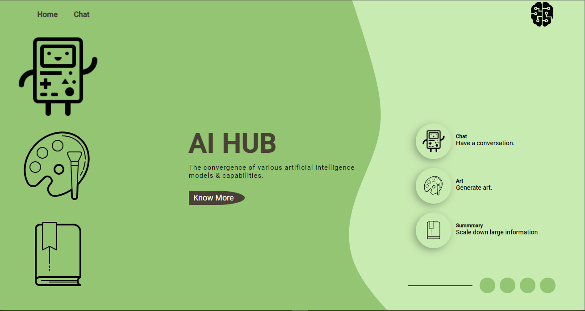
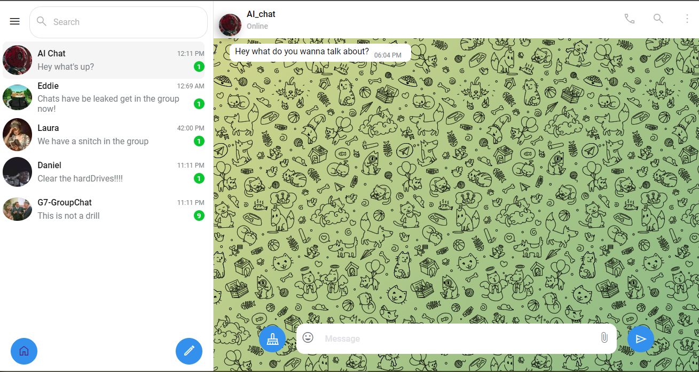
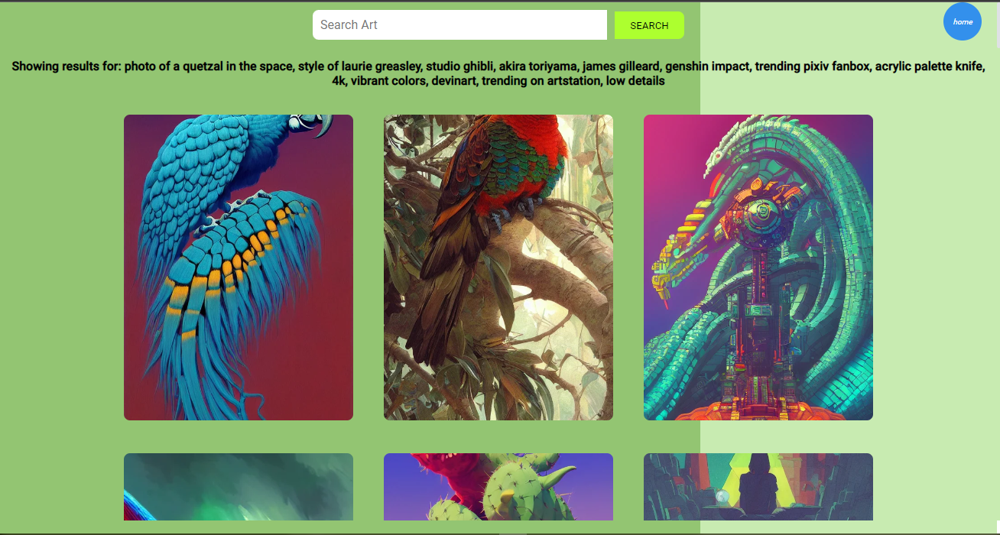
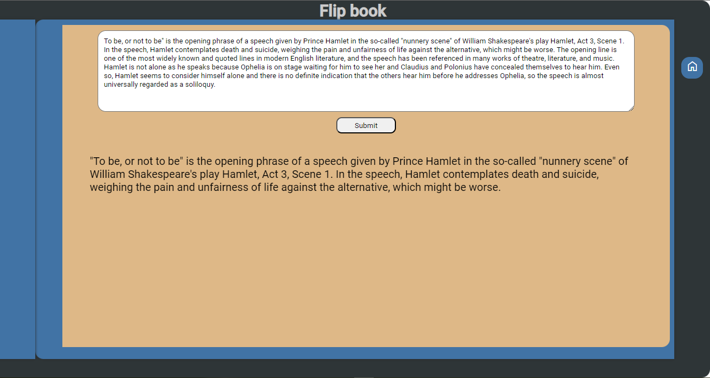

# [AI HUB](https://ai-hub-1.vercel.app/)

The convergence of various artificial intelligence models & capabilities.

## Table of Contents

1. [Getting started](#Getting-started)
2. [Usage](#Usage)
3. [Pages](#Pages)
   - [Chat](#chat)
   - [Art](#art)
   - [Text summarization](#summary)
4. [Contributors](#contributors)
5. [Licenses](#license)
6. [Sources](#Sources)

## <a id="Getting-started">Getting started</a>

The project can be accessed in 2 ways:

### 1. Website

You can access the site here - [AI Hub](https://ai-hub-1.vercel.app/)

### 2. Cloning

**Clone** the project files to your local repository:

- HTTPS => `https://github.com/edd-ie/AI-Hub.git`
- SSH => `git@github.com:edd-ie/AI-Hub.git`
- Git CLI => `gh repo clone edd-ie/AI-Hub`

Open the terminal and install all dependencies using.

```
npm install
```

In the terminal run this command to start the react app (accept the assigning of a new port if prompted)

```
npm start
```

Your default browser will be launched and the homepage will be rendered.


## <a id="Usage">Usage</a>

The homepage has a simple UI that allows for the user to navigate.

User can navigate to by either click the names on the navbar or relevant icon on the left side of the page

## <a id="Pages">Pages</a>

Each page uses a specific AI model to do a specialized task.

### <a id="chat">Chat</a>

The chat functionality uses the the `facebook/blenderbot-400m-distill` ai model which has been train on 400m test data to deliver a relatively smooth conversation AI.

It was shortlisted from a list of models like `gpt2, microsoft/dialoGPT_large, PygmalionAI/pygmalion-6b` just to name a few, after a series of parameter tunning and testing it had the most consistent result and was less prone to hallucinations.

The user interface it modeled afte the whatsapp chat UI to give the user the familiar feeling of having a chat with a friend.


### <a id="art">Art</a>

The art generation is handled by the lexica ai art model which uses stable diffusion to transform use input data to art in various art style


### <a id="summary">Text summarization</a>

Summary a large amount of information into comprehensible chunks with one click.

This works but utilizing the `facebook bart-large-cnn` an open source Convolutional Neural Networks from hugging faces that reads to the text and tries find the key takeaways from the document saving a user time and effort.


## <a id="contributors">Contributors</a>

This project was a team effort from the following individuals :

- [Edd.ie](https://github.com/edd-ie)
- [Laura Paullette](https://github.com/laura-paullette)
- [Daniel Orenge](https://github.com/dantezorenge)

## <a id="license">Licenses</a>

The project is licensed under the [BSD 3-Clause "New" or "Revised" License](https://github.com/highlightjs/highlight.js/blob/main/LICENSE), thus redistribution and use in source and binary forms are permitted provided that the conditions are met

## <a id="Sources">Sources</a>

The application uses open-source training data and AI models from [Hugging face](https://huggingface.co/models?pipeline_tag=conversational&sort=downloads) and [Lexica AI](https://lexica.art/) :

- Conversational Natural Language Processing(NLP) - [facebook/blenderbot-400m-distill](https://huggingface.co/facebook/blenderbot-400M-distill?text=Hey+my+name+is+Julien%21+How+are+you%3F)
- Art generation - [Stable diffusion](https://lexica.art/docs)
- Summarization Convolutional Neural Network (CNN) - [facebook/bart-large-cnn](https://huggingface.co/facebook/bart-large-cnn)

The icons and fonts are sourced from :

- Fonts source - [Google Fonts](https://fonts.googleapis.com/css2?family=Poppins:wght@300;400;500;600;700&display=swap)
- Icons source - [Google Icons](https://fonts.googleapis.com/css2?family=Material+Symbols+Outlined:opsz,wght,FILL,GRAD@48,400,1,0)
